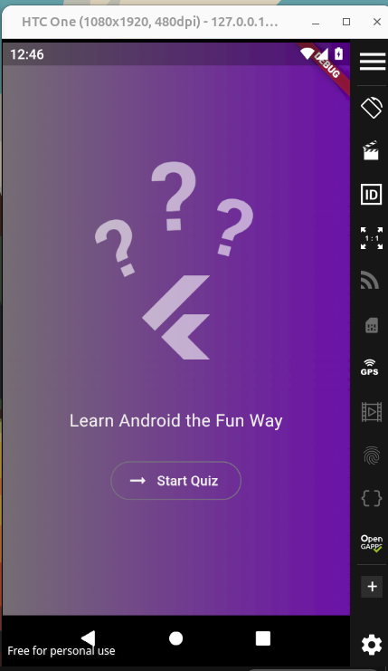
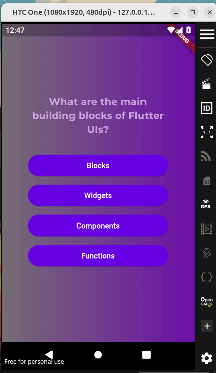
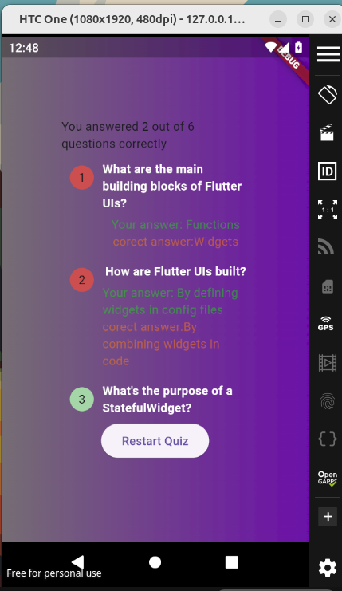

# Flutter Quiz App

A **Flutter** application that allows users to take quizzes on flutter topics. The app features multiple-choice questions, a score tracker, and a clean, user-friendly interface.

## Features
- 📝 Multiple-choice questions with different categories.
- 📊 Score tracker for quiz performance.
- 🎨 Clean and minimal UI design.
- 📱 Fully responsive for both Android and iOS.

## Screenshots
### Home Screen


### Quiz Screen


### Results Screen


## Getting Started

To clone and run this application, you'll need the following installed on your system:
- [Flutter SDK](https://flutter.dev/docs/get-started/install)
- [Android Studio](https://developer.android.com/studio) or [VS Code](https://code.visualstudio.com/)

### Clone the repository
```bash
git clone https://github.com/Priyanshu10101/flutter-quiz-app.git
cd flutter-quiz-app
